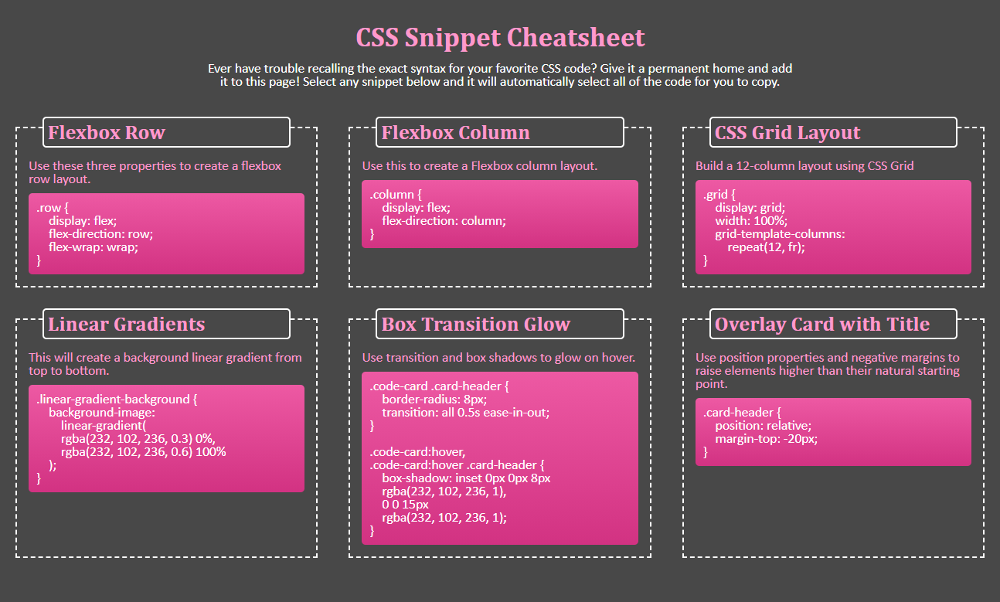

# CSS Cheatsheet Webpage

## Project Overview
CSS Cheatsheet 1.0 buildout. Developer leveraged CSS Flexbox and CSS global variables in this project, enabling a completely responsive webpage that adapts to the viewport of any device without a single media query.

### Technologies Used
<ul>
<li>HTML</li>
<li>CSS</li>
</ul>

## Live Application
https://captain63.github.io/css-snippet-mini-project/

## Screenshot
